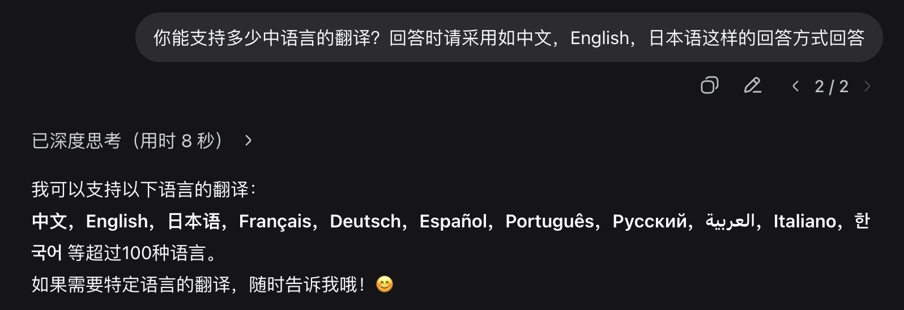
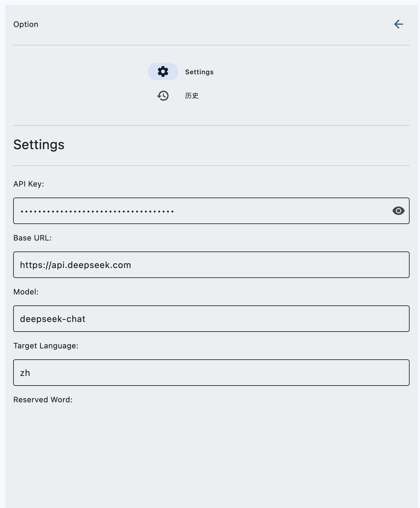
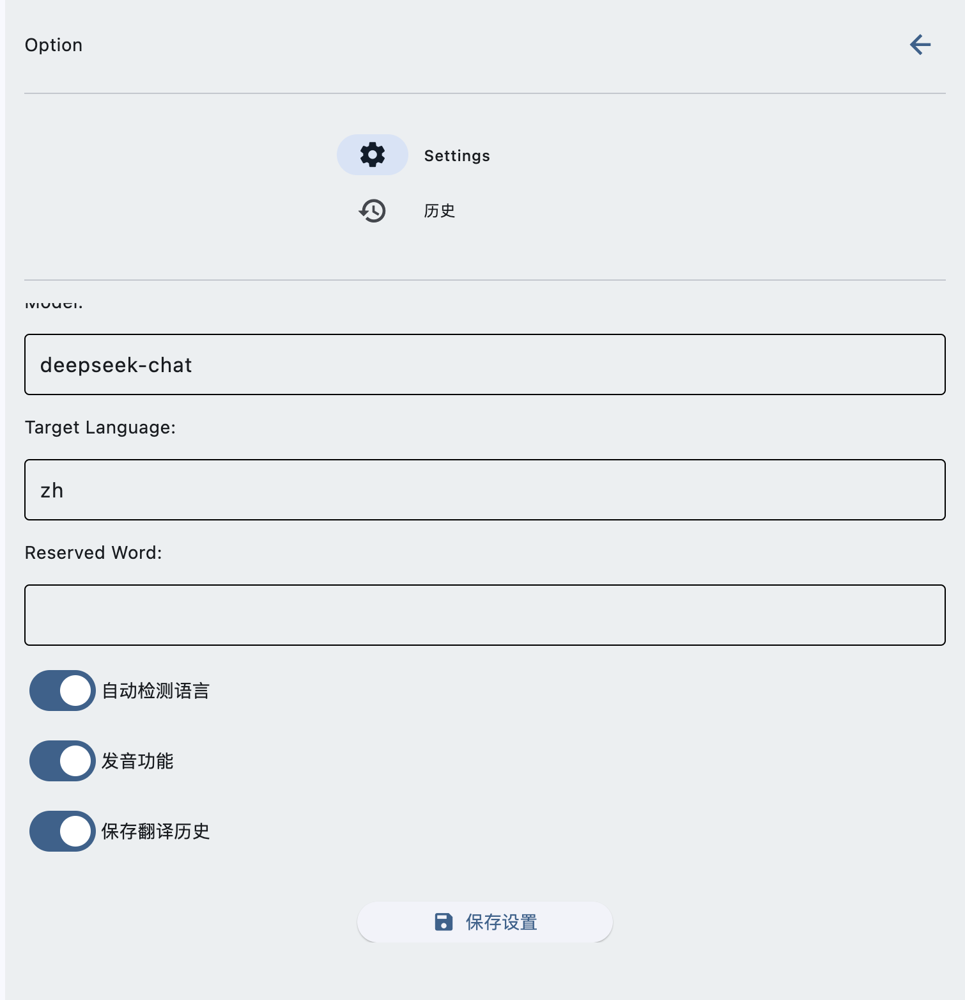
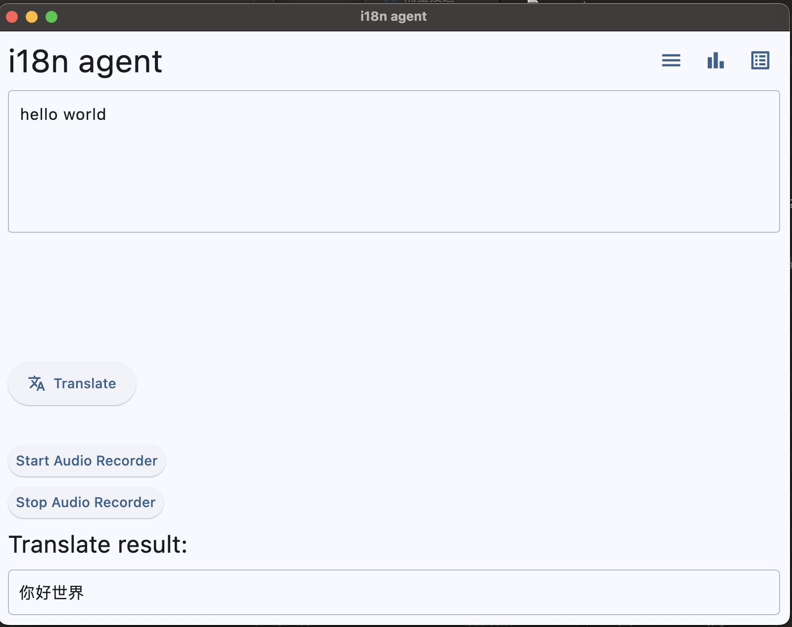

## Direcciones de Prueba
[Dirección de Prueba Mac ARM](https://github.com/SamYuan1990/i18n-agent-action/actions/runs/17428066641/artifacts/3914330255)  
[Dirección de Prueba Mac x86](https://github.com/SamYuan1990/i18n-agent-action/actions/runs/17428066641/artifacts/3914407540)  
[Dirección de Prueba Linux](https://github.com/SamYuan1990/i18n-agent-action/actions/runs/17428066641/artifacts/3914313680)

## Objetivos de Prueba  
1. ¿Cuántos idiomas puede soportar DeepSeek para la traducción?  
  

2. La robustez del prompt del sistema actual.  
https://github.com/SamYuan1990/i18n-agent-action/blob/main/Business/translateConfig.py#L67-L89  

3. Consistencia de frameworks de desarrollo como Flet a través de plataformas (Mac, Linux). Personalmente, creo que los futuros Agentes de IA soportarán varios métodos de integración. Por lo tanto, si frameworks como Flet pueden permitir la compilación y construcción multiplataforma desde una única base de código para ofrecer una experiencia de usuario consistente, sería una gran elección.  

## Pasos y Alcance de la Prueba  

> Mi computadora personal es una Mac x86, así que la usaré como referencia.

1. Descargar e instalar el software.  

> Puedes encontrar problemas de confianza con la firma. Intenta unas cuantas veces si es necesario.  

2. Configurar una clave API de DeepSeek.  
Por favor, consulta https://api-docs.deepseek.com/zh-cn/ o crea una a través de la plataforma web.  
  

> Por supuesto, todos también son bienvenidos a usar sus modelos de lenguaje grande existentes en formato OpenAI para ampliar el alcance de las pruebas.  

3. Configurar la información de acceso del modelo de lenguaje grande y guardarla.  
 

4. Ingresar el contenido a traducir y hacer clic en "Traducir" para esperar el resultado (nota: la entrada de voz está habilitada por defecto).  
 

5. Característica opcional: Palabras reservadas.  
Volver al Paso 1, agregar palabra reservada y reproducir hasta el paso 4.

## Si tienes habilidades técnicas y te gustaría probar la conversión de voz a texto, por favor contáctame. Actualmente, debido a limitaciones técnicas, solo está disponible una versión de desarrollo.