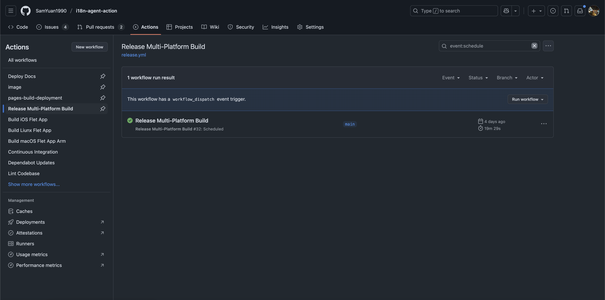
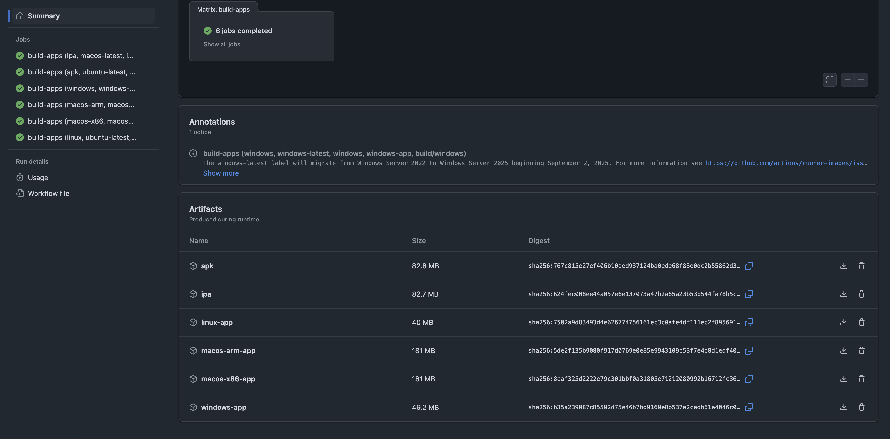

# 作为桌面应用或移动应用运行

## 支持平台

| macOS (x86) | macOS (arm) | Windows | Linux (x86?) | iOS | Android |
| ----------- | ----------- | ------- | ------------ | --- | ------- |
| ✅      | ✅       | 招募测试 | 招募测试 | 招募测试 | 招募测试 |

## 从 GHA 下载

前往 [链接](https://github.com/SamYuan1990/i18n-agent-action/actions/workflows/release.yml?query=event%3Aschedule)

找到最新构建
  

找到您的包
  

## 使用说明

> 我的个人电脑是 Mac x86，所以我将以此作为参考。

1. 下载并安装软件。  

> 您可能会遇到签名信任问题。如果需要，可以尝试几次，或者如果您是开发者，`sudo xattr -d com.apple.quarantine ~/i18n-agent-action.app 
codesign --force --deep --sign - --preserve-metadata=entitlements --options runtime ~/i18n-agent-action.app` 可能会有帮助。

2. 配置 DeepSeek API 密钥。  
请参考 https://api-docs.deepseek.com/zh-cn/ 或通过网页平台创建一个。  
  

> 当然，也欢迎大家使用现有的 OpenAI 格式大语言模型来扩大测试范围。  

3. 配置大语言模型访问信息并保存。  
 

4. 输入要翻译的内容，点击“翻译”等待结果（注意：默认启用语音输出）。  
 

5. 可选功能：保留字。  
回到步骤 1，添加保留字并重复到步骤 4。